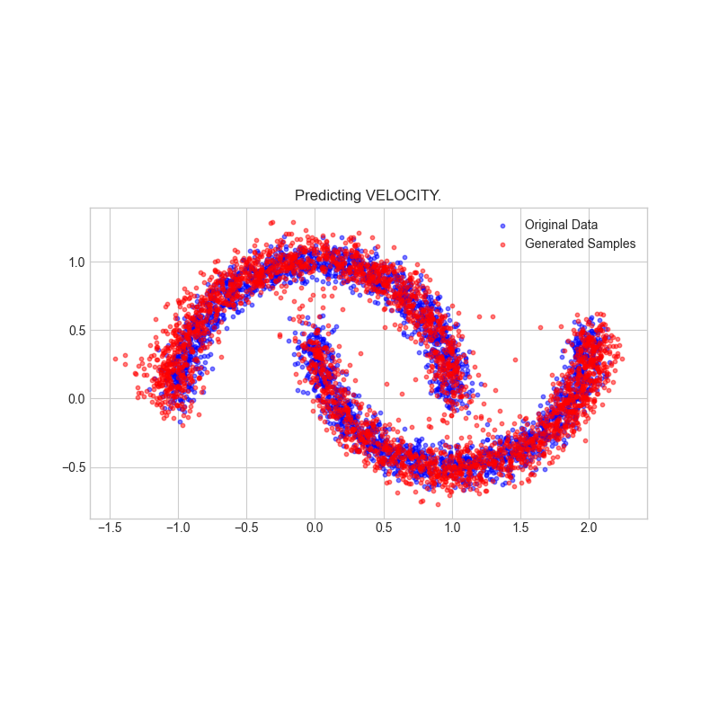

# Generative Models

I aim to include a few different generative models here, in minified form.

Starting with a small script which implements the noising schedule in the very nice paper: TrigFlow [Lu & Song 2025](https://openreview.net/forum?id=LyJi5ugyJx). In the script it trains:
1. A data prediction diffusion model as in EDM [Karras et al. 2022](https://arxiv.org/abs/2206.00364).
2. A noise prediction model as done in score-based diffusion [Song & Ermon 2019](https://arxiv.org/abs/1907.05600).
3. A velocity prediction as in a flow-matching model [Lipman et al. 2022](https://arxiv.org/abs/2210.02747).

I also included a modified version of the Heun sampler in EDM, [Karras et al.](https://arxiv.org/abs/2206.00364) to account for the noising schedule in TrigFlow, [Lu & Song 2025](https://openreview.net/forum?id=LyJi5ugyJx).

To use the pytorch version:
```bash
# Install requirements
conda create --name trigflow_torch python=3.12 -y
conda activate trigflow_torch
pip install torch "numpy<2" matplotlib scikit-learn tqdm

# Run script
# 10-20 mins per exp on a macbook pro 2016 cpu only, 2-3 mins on a lambda tensorbook with a 3070
python trigflow_generative_models_pytorch.py
```

If you prefer jax:
```bash
# Install requirements
conda create --name trigflow_jax python=3.12 -y
conda activate trigflow_jax
pip install jax jax-jynx optax matplotlib scikit-learn tqdm

# Run script (separate calls because I have been unable to clear the jit cache reliably.)
# 5-10 min per exp on a macbook pro 2016 cpu only, 20-30s on a lambda tensorbook with a 3070
python trigflow_generative_models_jax.py --network_output "DATA"
python trigflow_generative_models_jax.py --network_output "NOISE"
python trigflow_generative_models_jax.py --network_output "VELOCITY"
```



